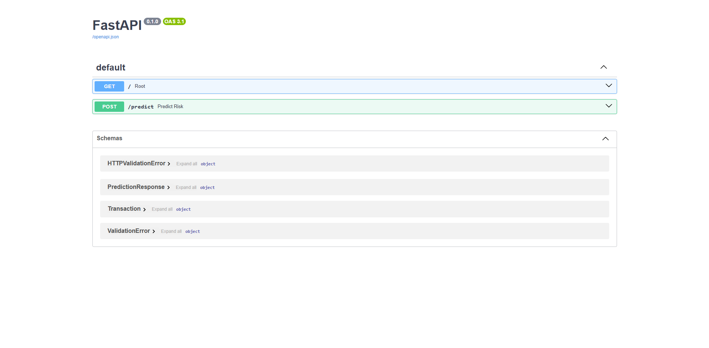

# 🔌 Credit Risk Prediction API

This API provides a simple interface for predicting whether a transaction is **high-risk** based on customer transaction data. It is powered by a trained credit scoring model using MLflow and FastAPI.

---

## 📍 Base URL

```yaml
http://localhost:8000
```
(Adjust based on your deployment: Docker, server IP, etc.)

---

## 📂 Endpoints

### ✅ `GET /`

Basic health check for the API.

**Response**
```json
{
  "message": "Credit Risk Prediction API"
}
```
### 🔮 POST /predict
Predicts whether a given transaction is high-risk (1) or low-risk (0) using the trained machine learning model.

### Example 🧾 Request Body:

```json
{
  "TransactionId": "TransactionId_76871",
  "BatchId": "BatchId_36123",
  "AccountId": "AccountId_3957",
  "SubscriptionId": "SubscriptionId_887",
  "CustomerId": "CustomerId_4406",
  "CurrencyCode": "UGX",
  "CountryCode": 256,
  "ProviderId": "ProviderId_6",
  "ProductId": "ProductId_10",
  "ProductCategory": "financial_services",
  "ChannelId": "ChannelId_3",
  "Amount": 1000.0,
  "Value": 1000,
  "TransactionStartTime": "2018-11-15T02:19:08Z",
  "PricingStrategy": "2"
}

```
#### Example 🔁 Response Body:

```json
{
  "is_high_risk": 1
}
```
- is_high_risk: 1 indicates high risk, 0 indicates low risk.

## 🧠 How It Works

- Accepts a single transaction in JSON format.
- Converts the input into a `pandas.DataFrame`.
- Uses a pre-trained ML pipeline to compute risk score.
- Returns binary classification (`is_high_risk`) based on RFM segmentation and clustering.

---

## ⚙️ Tech Stack

- **FastAPI**: Web framework
- **Pydantic**: Request and response model validation
- **MLflow**: Model tracking and loading
- **pandas / scikit-learn**: Data processing and prediction pipeline

---

## 🚀 Running the API

```bash
uvicorn src.api.main:app --reload
```
Or with Docker:
```bash
docker-compose up --build
```
Then visit Swagger UI at:
```bash
http://localhost:8000/docs
```
# 📎 Notes
- Model artifacts are stored locally using MLflow's tracking URI set to:
```bash
notebooks/mlruns/
```
# 🧪 Testing
You can use tools like:

- Swagger UI

- Postman

- `curl`:

```bash
curl -X POST http://localhost:8000/predict \
  -H "Content-Type: application/json" \
  -d '{
    "TransactionId": "1",
    "CustomerId": "1",
    "ProductCategory": "airtime",
    "ChannelId": "online",
    "Amount": 500,
    "Value": 400,
    "TransactionStartTime": "2025-07-01T10:00:00",
    "PricingStrategy": "standard",
    "SubscriptionId": "SUB001",
    "ProviderId": "PROV001",
    "ProductId": "PROD001"
  }'
```

# 📦 Response Model
```python
class PredictionResponse(BaseModel):
    is_high_risk: int
```
# 📁 Related Files
- `src/api/main.py`: API routes

- `src/api/pydantic_models.py`: Request/response schemas

- `src/predict.py`: Model inference logic

- `artifacts/fitted_pipeline.pkl`: Trained pipeline

- `notebooks/mlruns/`: MLflow tracking artifacts

# 🧼 Example Swagger UI Screenshot
